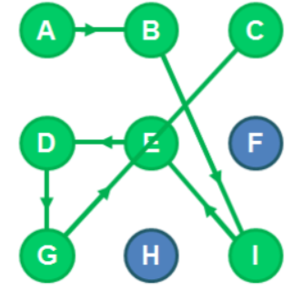

# Zadanie:

Z pewnością znasz zabezpieczenie smartfonu polegające na konieczności wprowadzenia na ekranie
geometrycznego wzoru jako kodu odblokowującego.
Aby odblokować urządzenie musisz, przesuwając palcem po ekranie smartfonu, połączyć linią łamaną
określone punkty. Uzyskana łamana jest kodem.
Rysunek poniżej przedstawia przykładowy kod składający się z 7 punktów [A, B, I, E, D, G, C].

### Introduction

Twoim zadaniem jest zaimplementowanie funkcji countcodes(start, length); gdzie :
start jest znakiem tekstowym odpowiadającym punktowi startu (np. “A”)
length liczbą naturalną określającą łączną ilość punktów składających się na łamaną (kod)
Funkcja countcodes ma zwracać liczbę wszystkich możliwych do uzyskania kodów o określonym
punkcie startu oraz zadanej długości.
Projektując funkcję musisz wziąć pod uwagę, że kolejne punkty łamanej mogą być ze sobą łączone
w określony sposób:
• poziomo (jak A do B)
• pionowo (jak D do G)
• diagonalnie (jak I do E lub B do I)
• przejście nad punktem jest możliwe, jeżeli punkt został już wcześniej użyty w łamanej
(połączenie z G do C przechodzące nad użytym wcześniej w łamanej punktem E)

##Powodzenia !
